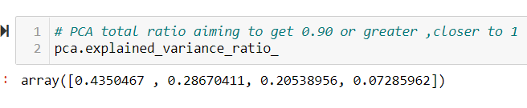
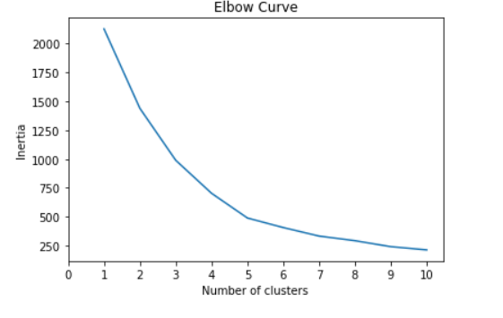
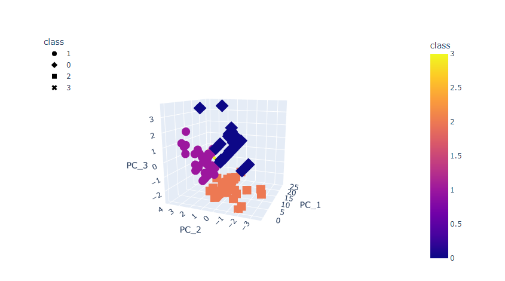
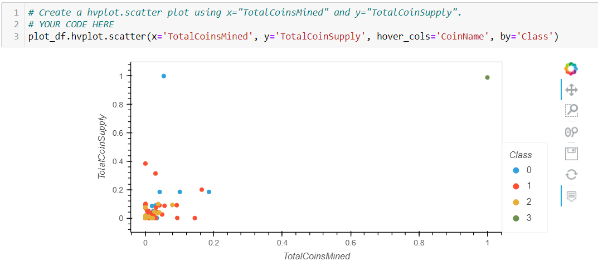

# Cryptocurrencies
Unsupervised Machine learning

Overview of the analysis:

A prominent investment bank, is interested in offering a new cryptocurrency investment portfolio for its customers. The company, however, is lost in the vast universe of cryptocurrencies. So, I have created a report that includes what cryptocurrencies are on the trading market and how they could be grouped to create a classification system for this new investment.

I have cleaned and scaled the data to fit the machine learning models. Since there is no known output for what we are looking for, I have decided to use unsupervised machine learning to group the cryptocurrencies, I have decided on a clustering algorithm. I used data visualizations to share findings with the board.

Results:

clustering algorithms group similar objects into clusters. There are numerous clustering algorithms. Most of these algorithms are distance-based. PCA reduces the number of features by combining and or removing features. The resulting features are referred to as components. In this analysis I have 4 components , explained_variance_ratio_ method of PCA is used to get the ration of variance (eigenvalue / total eigenvalues)  when I used 3 components the pca explained variance ratio was not closer to one , so I increase the components to 4,Then the ratio is 0.43+0.28+0.20+0.07=0.98

The elbow method is used to determine the optimal number of clusters in k-means clustering algorithms. Given a certain dataset, it puts the data in separate groups based on their similarity. The letter K stands for the number of clusters. In this analysis k=4 , we have identified similarities in 532 tradable cryptocurrencies and clustered them based on similarities , Now there are 4 clusters to offer a cryptocurrency investment portfolio.

Summary:

Nearly 17,000 different cryptocurrencies are traded publicly, according to CoinMarketCap.com. The total value of all cryptocurrencies on Jan. 18, 2022, was about $2 trillion, we can further analyse the clusters and choose best performing cryptos to add to the banks cryptocurrency investment portfolio. Unsupervised machine learning models helped to cluster similar cryptos together.
 